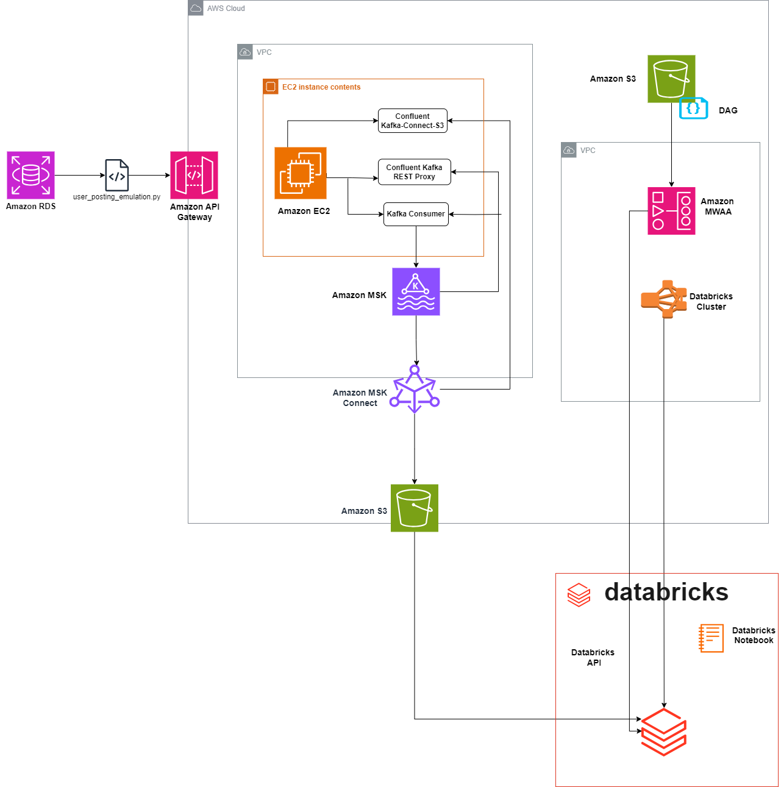

# Pinterest Data Pipeline

## Table of Contents

- [Description](#description)
- [Tools and Technologies](#tools-and-technologies)
- [Pipeline Architecture](#pipeline-architecture)
- [Data and database](#data-and-database)
- [File Structure](#file-structure)
- [License](#license)


## Description
In this project, commissioned by Aicore, I constructed two distinct pipelines – batch processing and streaming processing – with the aim of facilitating seamless data collection and transformation. Embarking on my inaugural endeavor into an end-to-end data pipeline project, I encountered a multitude of challenges. These hurdles ranged from familiarizing myself with novel technologies in AWS (including API Proxy Integrations, Kafka, Kinesis, MWAA) and Databricks, to navigating Design Architecture intricacies, code refactoring, and overcoming obstacles within the pipeline processes. These emerging technologies serve as the foundational elements for building scalable and efficient pipelines. Throughout this journey, my passion for data manipulation was reignited, further bolstering my resolve to achieve greater heights through unwavering dedication. 

A comprehensive report detailing the events and challenges encountered during the development process can be accessed through the following link: [report].

## Technologies
### Python Libraries
- `sqlalchemy`:
- `requests:`
- `urllib`:
- `random`:
- `time`:
- `datetime`:
- `json`:
- `airflow`:
- `pyspark.sql.functions`:
- `pyspark.sql.types`:

### AWS Services
- #### S3(Simple Storage Service):
- #### Amazon RDS :
- #### EC2(Elastic Compute Cloud):
- #### API Gateway:
- #### IAM(Identity and Access Management):
- #### MSK(Managed Streaming for Apache Kafka):
- #### MWAA(Managed Workflows for Apache Airflow):
- #### Kinesis:

### Databricks
 - #### Notebooks:
 - #### Delta Tables:

 ## Pipeline Architecture
 For this project, I developed two distinct data pipelines. One was designed for Batch Processing, utilizing an ELT (Extract, Load, Transform) pipeline, while the other was tailored for Streaming, employing an ETL (Extract, Transform, Load) pipeline. In the following sections, I will delve into their respective architectures, accompanied by provided diagrams.

 ### Batch Processing Architecture
 #### Data Extraction

 The data was initially stored in an AWS RDS instance using the extraction script, **user_posting_emulation.py**, which establishes a connection to the Amazon RDS database using specified credentials. Subsequently, the data was transferred to an Apache Kafka topic. To set up Kafka on an EC2 instance, the first step is to establish an SSH connection to the EC2 instance. Once connected, crucial details such as the bootstrap server string and the plaintext Apache Zookeeper connection string are retrieved from the MSK cluster via the MSK management console. In this scenario, three topics _pin_, _geo_, and _user_ were created .

For additional details, please refer to the docstrings within the **user_posting_emulation.py script**.


#### Data Loading
Upon extracting rows from the Amazon RDS database using user_posting_emulation.py, each extracted row undergoes transmission to a REST API integrated with Kafka REST proxy. Following the data transmission to the API, the subsequent steps unfold:

1. REST API Integration with Kafka: The REST API receives the posts dispatched by the extraction script and establishes communication with a Kafka producer via MSK Connect. This interaction utilizes pre-configured Kafka workers within a plugin that I established.

2. Kafka Producer Writing Events: The Kafka producer records events to a Kafka topic for each post, referred to as kafka event streaming. In this process, the user_posting_emulation.py script is adjusted to dispatch data from the three tables to their respective Kafka topics using the API invoke URL.

3. Storage in S3: The Kafka topics are configured to store events in an S3 bucket.
#### Data Transformation
Before initiating any transformations, it's imperative to mount the S3 bucket to Databricks, ensuring that the data is accessible within the Databricks environment. The code for mounting can be located in the **mount_s3_buckets.ipynb** notebook. Once the S3 bucket has been successfully mounted, the transformation process, specifically the cleaning stage, commences in the **batch_processing.ipynb** notebook.

#### Orchestration
In this context, a DAG named <IAM_username>_dag.py is created, tailored for deployment on Managed Workflows for Apache Airflow (MWAA) to facilitate automated batch processing. MWAA serves as the platform for monitoring and scheduling workflows. The DAG is configured to trigger daily, ensuring that data transformation occurs consistently at a predetermined time each day, thereby accommodating the integration of new batch data.


#### Architectural Diagram

The diagram provided illustrates the primary architectural components of the batch processing framework .





### Stream Processing Architecture
Similar to previous architecture, the data source originated from an Amazon RDS database. This extraction procedure encompassed data retrieval from three distinct tables: pin data, geo data, and user data. Facilitated by the script named user_posting_emulation_streaming.py, the extraction process initiates a connection to the Amazon RDS database utilizing provided credentials. For security measures, these credentials are stored in an independent file, subsequently loaded into the script during its execution.
For additional details, kindly refer to the documentation strings within the **user_posting_emulation_streaming.py script**.

#### Data Transformation
Upon forwarding the extracted data to the API, Amazon Kinesis seamlessly intercepted the data flow, facilitated by the API Gateway's Kinesis proxy integration setup. Subsequently, within the Kinesis service, the data underwent organization into streams, a configuration I oversaw.

Following this, I retrieved the data from the Kinesis streams to Databricks, where I proceeded to cleanse the data using native Spark functions. This entire procedure is documented in the notebook **Kinesis_stream.ipynb**.

#### Data Loading
Upon completing the data cleansing process in Databricks, the Spark Dataframes were transferred to Delta Tables, a task facilitated by a custom function implemented in the **Kinesis_stream.ipynb** notebook. If necessary, additional analysis can be conducted.

#### Architectural Diagram

The following diagram visually depicts the key architectural components within the stream processing framework.


#### Data
Once the data has been processed in each of the pipelines, three tables are generated: pin_table, geo_table, and user_table. Let's examine each of them in detail:
##### pin_table
This table contains information about the Pinterest post data.


##### geo_table
This table comprises details pertaining to the geolocation data associated with the Pinterest post.


##### user_table
This table contains information about the User data connected to the Pinterest post.


### The Database diagram
Here is the database diagram illustrating the interrelationships among the data. It serves as a valuable reference for data querying purposes.


### Querying the Data
Some questions you can run queries on:
- Find how many users have joined between 2015 and 2020.
- Find the median follower count of users have joined between 2015 and 2020.
- Find the most popular Pinterest category people post to based on their country.
- Find how many posts each category had between 2018 and 2022.
- Find the country with the user with most followers.
- What is the most popular category people post to based specified age groups
- What is the median follower count for users in the above specified age groups
- Find the median follower count of users that have joined between 2015 and 2020, based on which age group they are part of.

### File Structure

```
└── 📁Databrick_notebooks
       └── Kinesis_streams.ipynb
       └── mount_S3_bucket
       └── Pinterest_batch_processing.pynb
└── 📁Diagrams
       └── database_diagram
       └── pinterest_batch_diagram
       └── pinterest_stream_diagram
       └── geo_table
       └── pin_table
       └── user_table
└── 📁Posting_emulation_scripts
       └── user_posting_emulation
       └── user_posting_emulation_streaming
└── 📁<IAM_username>_dag.py
└── 📁README.md


└── 📁kafka_2.12-2.8.1
       └── bin
            └── client.properties
        └── libs
             └── aws-msk-iam-auth-1.1.5-all-jar
└── 📁kafka-connect-s3
        └── confluentinc-kafka-connect-s3-10.0.3.zip
└── 📁confluent-7.2.0
        └── etc
             └── kafka-rest
                    └──kafka-rest.properties


   


        


       
```


